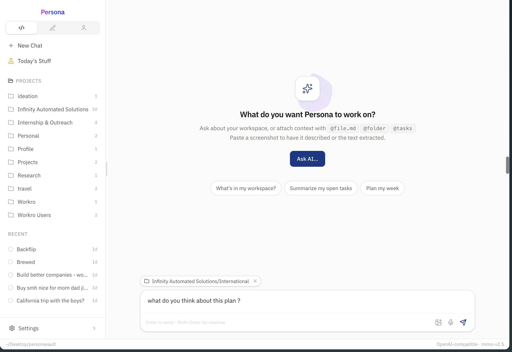
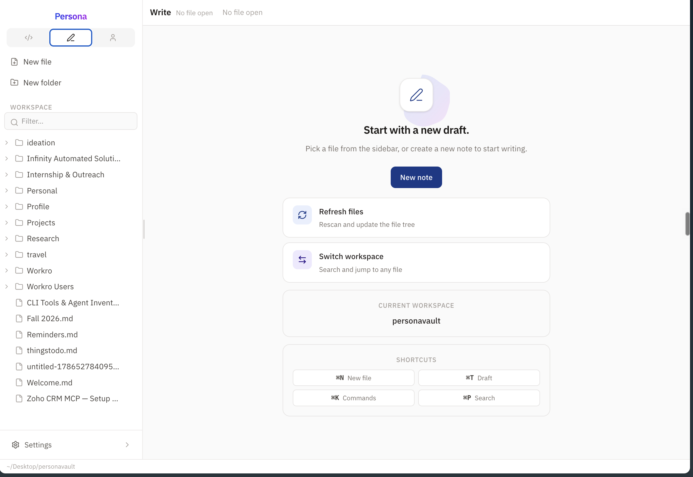
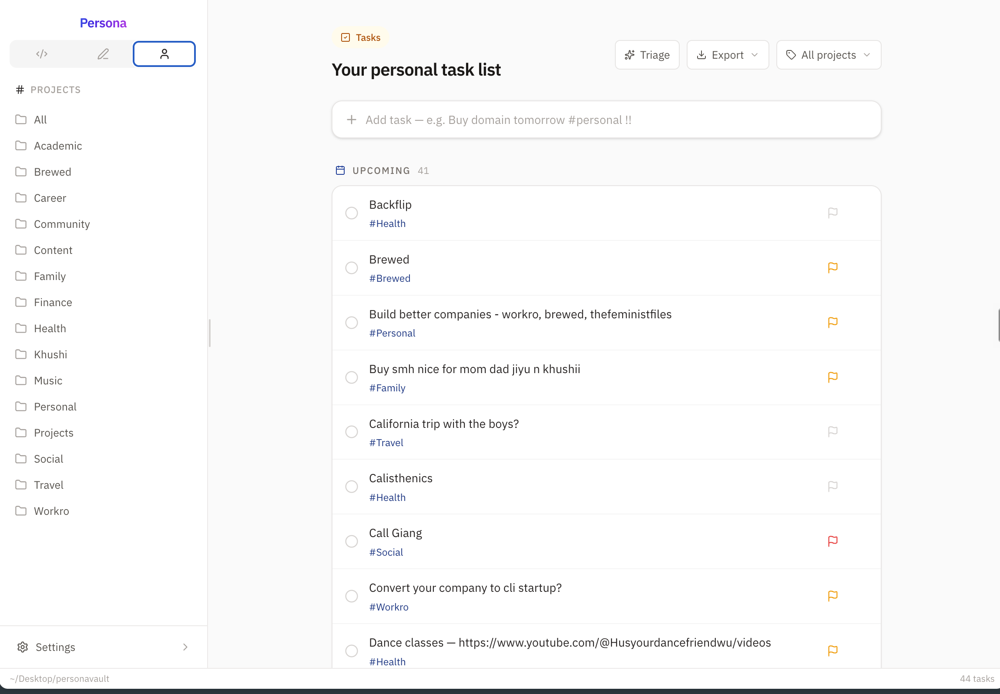

# Persona

[](https://github.com/jayamitkatariya/personacli/stargazers)
[](LICENSE)
[](package.json)
[]()

Notes, tasks, and an AI chat that knows your files. Everything lives in one folder
of plain Markdown on your machine.

```
$ persona
```

That starts a local server and opens your workspace in the browser. No accounts,
no cloud, no database. If this project vanished tomorrow, you'd still have every
note and task as `.md` files you can open with anything.

## Why another notes app?

Because I kept choosing between nice software and owning my data:

| | Persona | Obsidian | Notion | Logseq |
|---|---|---|---|---|
| Data format | plain Markdown | Markdown + plugins | proprietary cloud DB | org-mode/Markdown |
| Works fully offline | ✅ | ✅ | ❌ | ✅ |
| Built-in tasks | ✅ | plugin | ✅ | basic |
| Local AI chat | ✅ Ollama, zero config | via cloud API plugins | their cloud | ❌ |
| Voice input | ✅ local STT | ❌ | ❌ | ❌ |
| Open source | ✅ MIT | freemium, closed | closed | ✅ AGPL |

I used Obsidian daily for two years. Somewhere around plugin thirty I realized I
was maintaining my note setup more than writing in it. Persona is my attempt at
the version where everything important just works out of the box and the data
format never holds you hostage.

## What you get

- **Markdown notes** — files on disk in whatever folder structure you like. Edit
  them from any app; Persona watches the filesystem and keeps up
- **Tasks** — write `fix login bug #backend !! friday` and it sorts out priority,
  project tag and due date into frontmatter. Kanban view included
- **AI chat** — connects to [Ollama](https://ollama.com) automatically if it's
  running (free and private), or use any OpenAI-compatible API. It can create
  notes and manage tasks, not just answer questions
- **Semantic search** — embeddings computed locally, stored inside the workspace
- **Voice input** — local speech-to-text via parakeet.cpp on Apple Silicon
- **MCP server** — Claude Code, Cursor and other agents can read/write your
  workspace directly

## Screenshots

<p align="center">
  
</p>
<p align="center">
  
</p>
<p align="center">
  
</p>

## Quick start (macOS)

You need Node.js 20+ (`brew install node`) and git.

```sh
git clone https://github.com/jayamitkatariya/personacli.git
cd personacli
npm install --allow-scripts=persona
npm install -g . --allow-scripts=persona
persona
```

First run walks you through picking a workspace folder and optionally connecting
an AI model. After that it's just `persona`.

### Want the AI to run free and private?

```sh
brew install ollama && ollama pull llama3.2
persona   # detects ollama automatically, no config
```

<details>
<summary>More commands, updating, voice input setup, uninstalling</summary>

```sh
persona doctor   # health check: node, workspace, server, AI config
persona path     # print workspace path
```

Updating:
```sh
cd personacli && git pull
npm install --allow-scripts=persona
npm install -g . --allow-scripts=persona
```

Uninstalling:
```sh
npm uninstall -g persona
pkill -f "dist/server/index"
rm -rf ~/.persona
```

Troubleshooting lives in full detail further down this README.

</details>

## The stack

TypeScript end to end. React UI served by a Hono server, Vite for builds.
Local embeddings for search, parakeet.cpp for voice, Ollama or any
OpenAI-compatible endpoint for chat. Boring tech on purpose.

## Contributing

Issues and PRs welcome, especially bug reports from real usage. If something
feels off, it probably is; tell me.

## License

[MIT](LICENSE)

---

If Persona saves you some sanity, a star helps other people find it.

### Optional extras

| Extra | Install | What you get |
| --- | --- | --- |
| [Ollama](https://ollama.com) | `brew install ollama && ollama pull llama3.2` | Free, private local AI — detected automatically, no API key |
| `ffmpeg` | `brew install ffmpeg` | Voice input (records + transcribes in chat) |
| parakeet model | [parakeet.cpp releases](https://github.com/mudler/parakeet.cpp/releases) | Local speech-to-text model for voice input |

For voice input, point Persona at your parakeet binary and model:

```sh
export PERSONA_STT_BIN=/path/to/parakeet-cli
export PERSONA_STT_MODEL=/path/to/model.gguf
persona
```

### Troubleshooting

| Symptom | Fix |
| --- | --- |
| `persona: command not found` | `npm install -g . --allow-scripts=persona` again, and check `npm config get prefix` is on your `PATH` |
| `npm warn allow-scripts` or `persona` binary missing after install | npm ≥11.16 blocks package scripts by default — install with `--allow-scripts=persona` (or run `npm config set allow-scripts=persona --location=user`) and reinstall |
| `npm install -g .` fails with `EACCES` | Your npm prefix isn't writable — install Node via [nvm](https://github.com/nvm-sh/nvm) or [Homebrew](https://brew.sh) (or use `sudo` as a last resort) |
| Server won't start / port errors | `persona doctor`, then check `~/.persona/logs/server.log` |
| Chat says "no model configured" | Open **Settings → AI** (⌘,) and add a provider, or install Ollama |
| You run `persona` and nothing happens | The server may already be running — press ⌘K in the browser, or kill it with `pkill -f "dist/server/index"` and retry |
| Voice input fails | `ffmpeg` must be installed and `PERSONA_STT_MODEL` must point at a valid GGUF |

## First run

The first time you run `persona`, a short setup guide walks you through three
steps in the browser:

1. **Workspace** — where Persona stores your notes (`~/Persona` by default).
   `Notes/`, `Projects/` and `.persona/tasks/` are created for you.
2. **AI** — optional. A running [Ollama](https://ollama.com) is detected and
   connected with zero setup; otherwise add any OpenAI-compatible API key.
   Skip any time and set it up later in **Settings → AI** (⌘,).
3. **Done** — a `Notes/Welcome.md` note is created as a guided tour of the
   workspace: the three views, keyboard shortcuts and terminal commands. Open
   it again any time from the command palette (⌘K → "Open Welcome note").

Nothing is ever overwritten: if the workspace folder already has files, they
appear in the sidebar untouched, and the welcome note is only created once.

## Commands

| Command | What it does |
| --- | --- |
| `persona` | Start the server if needed, open the workspace in your browser |
| `persona open` | Start the server if needed, open the workspace in your browser |
| `persona note "text"` | Append a line to today's journal note (`Notes/YYYY-MM-DD.md`) |
| `persona task "Buy domain tomorrow #personal !!"` | Create a task (natural language) without opening the browser |
| `persona triage` | Ask the AI to review your open tasks (suggestions only) |
| `persona ask "what's left on the PRD?"` | Chat with the AI from the terminal, answer streams inline. Attach files/folders/tasks with `@file.md`, `@folder`, `@tasks` |
| `persona today [--open]` | Create/open today's journal note; `--open` launches the browser |
| `persona search "query"` | Search files and tasks from the terminal (fuzzy + semantic) |
| `persona path` | Print the current workspace path |
| `persona doctor` | Health check: node, workspace, server, AI config |
| `persona mcp` | Run Persona as an MCP server (stdio) for Claude Code, Hermes, Cursor, etc. See `docs/mcp.md` |

## What lives where

```
~/Persona/                  ← your workspace (choose it on first run)
├── Notes/                  ← plain Markdown, organised however you like
├── Projects/
│   └── my-project/
│       └── PRD.md
├── Imported/               ← notes brought in from other apps
│   ├── obsidian/
│   ├── bear/
│   ├── roam/
│   ├── notion/
│   └── plain/
└── .persona/
    ├── tasks/              ← tasks are Markdown files with frontmatter
    ├── agents/             ← background agent runs (JSON)
    ├── pins.json           ← your pinboard (pinned notes & tasks)
    └── embeddings/         ← local semantic-search index (notes, not secrets)
```

Tasks are just files:

```md
---
type: task
status: todo
priority: high
due: 2026-08-12
project: Personal
---
Finish Persona PRD
```

Edit them in any editor, or in Finder — Persona watches the filesystem and
syncs automatically.

## Workspaces

- **Write** — file tree + Markdown editor (CodeMirror). Autosave, save
  status, live preview (Edit / Split / Preview), rename, move, duplicate,
  delete, drag & drop. Open several notes at once in tabs (⌘W to close,
  ⌘⇧[ / ⌘⇧] to cycle); each tab keeps its own scroll position and undo
  history. AI-generated tags: press ⌘S (or the ✨ button) and Persona
  suggests tags for your note, added automatically as YAML frontmatter.
- **Tasks** — fast personal task list. Type `Buy domain tomorrow #personal !`
  in the quick-add box; dates, projects and priority are parsed for you.
  Recurring tasks work too: `Water plants every week` reopens itself with
  the next due date when you complete it. Hit **Triage** (or run
  `persona triage`) and the AI reviews your open tasks — flagging wrong
  priorities, missing due dates, untagged projects, stale tasks and
  duplicates — and applies each suggestion with one click. It never changes
  a task without you approving.
- **Pinboard** — pin important notes or tasks (⋯ menu in the file tree or
  task row) and they stay pinned to the top of the sidebar on every tab.
  Click a pin to jump straight to it; hover to unpin. Pins live in
  `.persona/pins.json` and survive restarts.
- **Chat** — an AI that can see your workspace and act on it. Attach context
  with `@file.md`, `@folder` or `@tasks` and ask about your actual work.
  The AI can also create, edit, move and delete notes and folders, and
  create, complete, update and delete tasks on your behalf — you'll see a
  small status chip for each action it takes.
- **Agents** — background AI runs for multi-step work. Give Persona a task
  like "organize my inbox notes" and it works through it with tools, live,
  without holding a chat open. Runs are persisted under
  `.persona/agents/` and can be cancelled, retried, or deleted.
- **Semantic search** — your notes are embedded locally and searched by
  meaning, so "that thing I wrote about camping" finds the note that mentions
  the forest, the tent, and the rain — even if it never says "camping".
  It powers the command palette (⌘P), `persona search`, and the chat: when
  you don't attach context, the assistant automatically pulls in the notes
  most relevant to your question and cites them.
- **Modules** — Focus, Journal, Today's Stuff, and Agents are toggleable from
  **Settings → Modules**; enabled modules show in the sidebar, disabled ones
  stay reachable from ⌘K.
- **Import** — bring in Obsidian, Bear, Roam, Notion, or plain-folder exports
  from **Settings → Import**. Everything lands under `Imported/<source>/` and
  never overwrites existing notes.

## Keyboard

| Shortcut | Action |
| --- | --- |
| `⌘K` | Command palette |
| `⌘P` | Quick file/task search |
| `⌘1` `⌘2` `⌘3` | Write / Tasks / Chat |
| `⌘N` | New file |
| `⌘⇧N` | New task |
| `⌘T` | New draft note |
| `⌘W` | Close tab |
| `⌘⇧[` `⌘⇧]` | Previous / next tab |
| `⌘S` | Save |
| `⌘,` | Settings |
| `⌘⇧B` | Toggle sidebar |
| `Esc` | Close palette / modal |

## AI

Any OpenAI-compatible provider works — OpenAI, OpenRouter, Ollama, local
models, custom endpoints. Configure provider, base URL, model and API key in
**Settings → AI**. The key is stored in the macOS Keychain (falls back to a
0600-permissioned config file) and is only ever sent to the provider you
chose.

**Zero setup with Ollama.** If a local Ollama instance is running
(`http://127.0.0.1:11434`, or wherever `$OLLAMA_HOST` points), Persona
detects it automatically and connects with no API key and no configuration.
It picks a sensible chat model from the ones you have installed. An
explicitly configured provider always takes precedence over auto-detection,
and `persona doctor` reports what was detected.

The chat assistant is write-capable: it can create and edit notes, create
folders, move and rename files, and manage your tasks — create, update,
complete and delete them. It deletes files or folders only when you
explicitly ask it to. Providers without tool support automatically fall
back to read-only chat.

**Semantic search.** Notes are chunked and embedded locally and stored in
`.persona/embeddings/`. Embeddings come from, in priority order:
1. An **explicit embedding base URL** (optional, Settings → AI) — point this at
   any embeddings-capable provider (OpenRouter, SiliconFlow, a local Ollama…).
2. A **running local Ollama with an embedding model** — e.g.
   `ollama pull all-minilm` or `nomic-embed-text` — no API key required.
3. Otherwise, your chat provider's endpoint.

The index rebuilds in the background when the server starts, when your API key
or embedding model changes, and incrementally whenever a note is saved.
Keyword search still wins for exact matches; semantic results appear as "Best
matches" when they add value. If no embedding source is available, search
silently falls back to keyword-only.

**Voice input (macOS).** The chat box has a mic button for local
speech-to-text via [parakeet.cpp](https://github.com/mudler/parakeet.cpp).
Requires `ffmpeg` (`brew install ffmpeg`) and a parakeet-compatible GGUF model.
Grab a prebuilt `parakeet-cli` for macOS from the
[releases page](https://github.com/mudler/parakeet.cpp/releases) and point
Persona at both with `PERSONA_STT_MODEL=/path/to/model.gguf` and
`PERSONA_STT_BIN=/path/to/parakeet-cli` (on Apple Silicon the model runs on
Metal).

## Appearance

Light, dark, or system theme in **Settings → Appearance**. The theme is
saved in your config and follows your macOS appearance when set to System.

## Development

```sh
npm run dev        # Vite dev server (5173) + API server (4321), hot reload
npm run build      # production build: server + CLI + web app
npm run typecheck
```

Ad-hoc test scripts (need a build first):

```sh
npm run build
node scripts/tool-test.mjs       # unit-level tests for AI tools, tasks, fs
node scripts/mcp-test.mjs        # E2E: MCP server via stdio (Persona tools over MCP)
node scripts/e2e-chat-test.mjs   # E2E: AI chat performs file & task operations
node scripts/e2e-chat2-test.mjs  # E2E: chat reads notes and cites sources
```

The E2E scripts expect a server to be running against a throwaway workspace
(e.g. `HOME=$PWD/.testhome npm run dev:server` on another terminal, so the
server's config lands in `.testhome/.persona/`).

## MCP — use Persona from Claude Code, Hermes, Cursor, etc.

Persona is an MCP server. Any MCP client can read/write your workspace:

```sh
persona mcp --help
claude mcp add persona -- persona mcp   # Claude Code
# Hermes/Cursor/Windsurf: { "mcpServers": { "persona": { "command": "persona", "args": ["mcp"] } } }
```

Tools: 15 (`list_folder`, `read_note`, `create_note`, `write_note`, `append_note`, `create_folder`, `move_file`, `rename_file`, `delete_file`, `list_tasks`, `create_task`, `update_task`, `delete_task`, `search`, `get_workspace_info`) + resources (`persona://workspace`, `persona://file/{path}`) + Streamable HTTP at `http://127.0.0.1:4321/mcp`.

Full setup → `docs/mcp.md`.

## Contributing

Open an issue or PR — bug reports, feature ideas and questions are all
welcome. Guidelines:

- Keep the local-first promise: everything is plain files, no accounts, no
  cloud, no lock-in.
- The server must never send your files to anyone but the AI provider you
  explicitly configured; the embeddings index is local.
- Run `npm run typecheck` and `npm run build` before opening a PR, and add a
  `scripts/` test when you touch server behaviour.
- Package is MIT licensed; by contributing you agree to the same terms.

## Architecture

```
persona CLI ── spawns ──▶ local Hono server (127.0.0.1:4321 — first free port)
                              │  REST API + SSE events
                              ├─ filesystem (chokidar watcher)
                              ├─ tasks (Markdown + frontmatter)
                              ├─ AI (OpenAI-compatible, streaming)
                              └─ embeddings (semantic index, local JSON)
                              │
                              ▼
                    React app (prebuilt, served by the server)
```

## Star History

[](https://star-history.com/#jayamitkatariya/personacli&Date)
